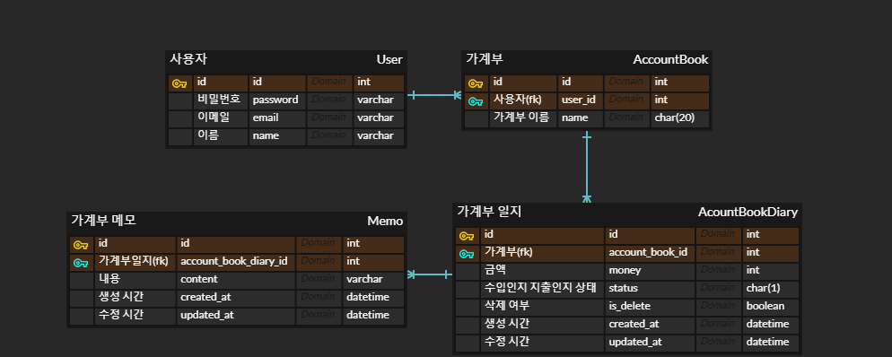

# 03_Payhere_B-jslee

페이히어 백엔드 과제 전형

# 설계

## ERD

  

## User

### MODEL

- User
    - **id(pk)**
    - name
    - email
    - password

### API

- Functiona
    - /api/signup: 회원가입
    - /api/login: 로그인
    - /api/logout: 로그아웃

- 제약사항
    - 토큰 인증 방식

## AccountBook

### MODEL

- AccountBook(가계부)
    - **id(pk)**
    - user(fk - OneToOne): User 모델과 1:1 관계
    - name: 가계부 이름
    - money: 금액
    - status: 수입/지출 상태
    - is_delete: 삭제 여부
    - created_at: 생성 날짜
    - updated_at: 수정 날짜

- Memo(메모)
    - **id(pk)**
    - account_book(fk - OneToMany): 가계부와 외래키
    - content: 메모 내용
    - created_at: 생성 날짜
    - updated_at: 수정 날짜

### API

- CRRUD
    - `GET` /api/account-book 가계부 목록 조회
    - `POST` /api/account-book 가계부 생성
    - `POST` /api/account-book/:id/memo
    - `GET` /api/account-book/:id 가계부 상세내용 조회 + Memo
    - `PATCH/PUT` /api/account-book/:id 가계부 내용 수정
    - `PATCH/PUT` /api/account-book/:id/memo/:id 메모 수정
    - `DELETE` /api/account-book/:id 가계부 삭제(soft delete)
    - `DELETE` /api/account-book/:id/memo/:id 메모 삭제(hard delete)
- function
    - /api/account-book/:id/retore 가계부 복구
- 제약사항
    - 로그인한 사용자가 본인의 가계부만 접근 가능
    - 삭제한 내역을 복구할 수 있어야함